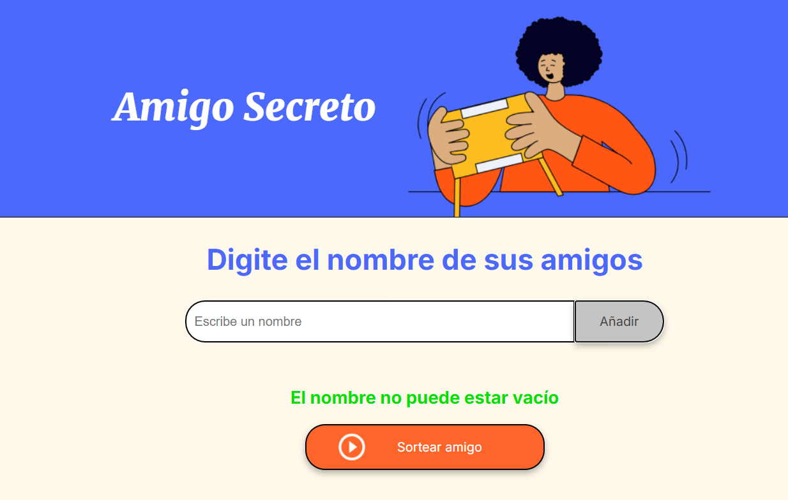
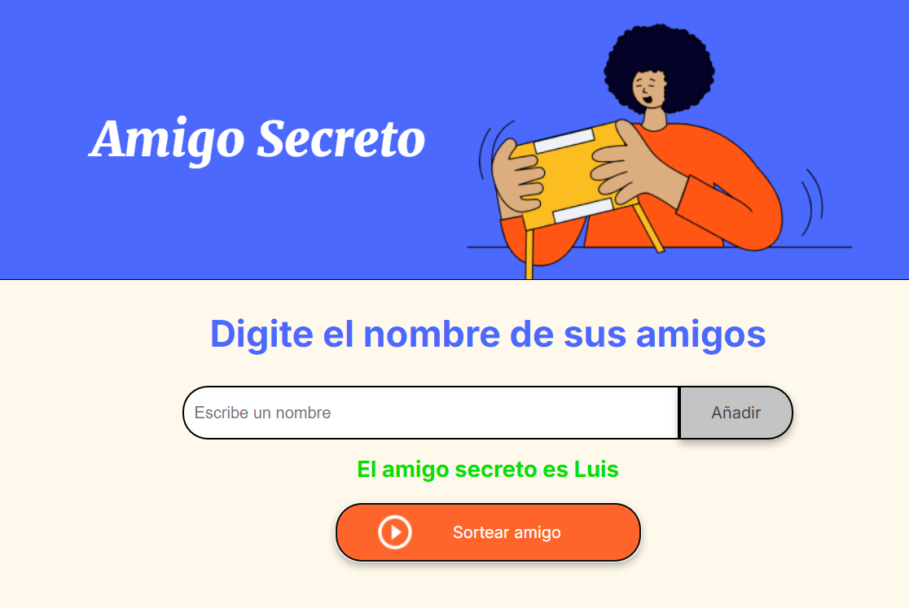

El presente proyecto tiene como objetivo crear un juego de amigo secreto. El juego consiste en
introducir el nombre de un amigo, que luego se añade a una lista de amigos. El juego validara que
no se deje el campo vacío, que el nombre de los amigos contenga solo letras, y que no exista un
amigo con el mismo nombre. Si se introduce un nombre de amigo válido, se añadirá al listado de amigos
y ya estara disponible para ser sorteado.

Después de introducir los amigos, el juego realiza un sorteo aleatorio entre los amigos insertados
y muestra el nombre del amigo secreto de ese sorteo. Si no hay amigos insertados, el juego muestra
un mensaje indicando que no hay amigos por sortear al igual que si se sortean todos los amigos
ingresados en la lista.

Para ingresar al juego, se debe abrir el archivo index.html en el navegador web. El juego se
ejecutará en el navegador web de la máquina local, por lo cual solo sera accesible desde la misma
máquina que se ejecuto el archivo index.html.
A continuación, se presenta una imagen que ilustra el funcionamiento del juego:

